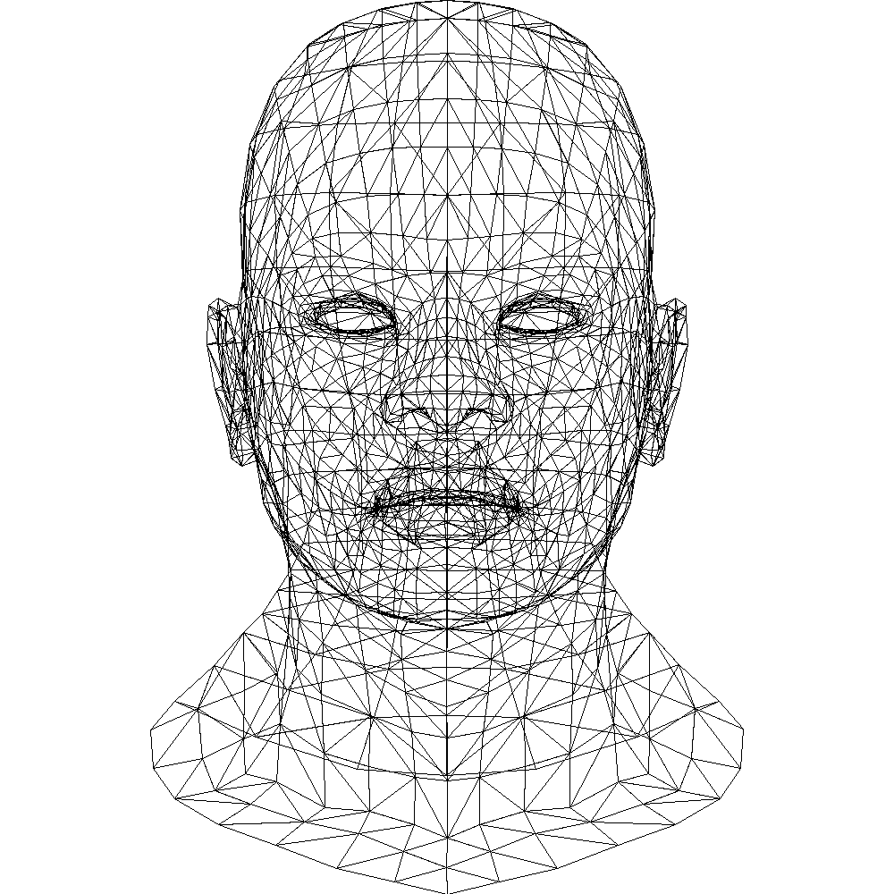
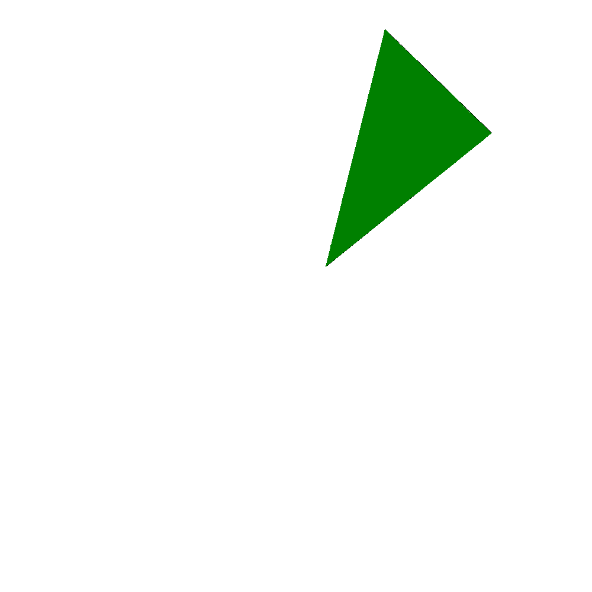
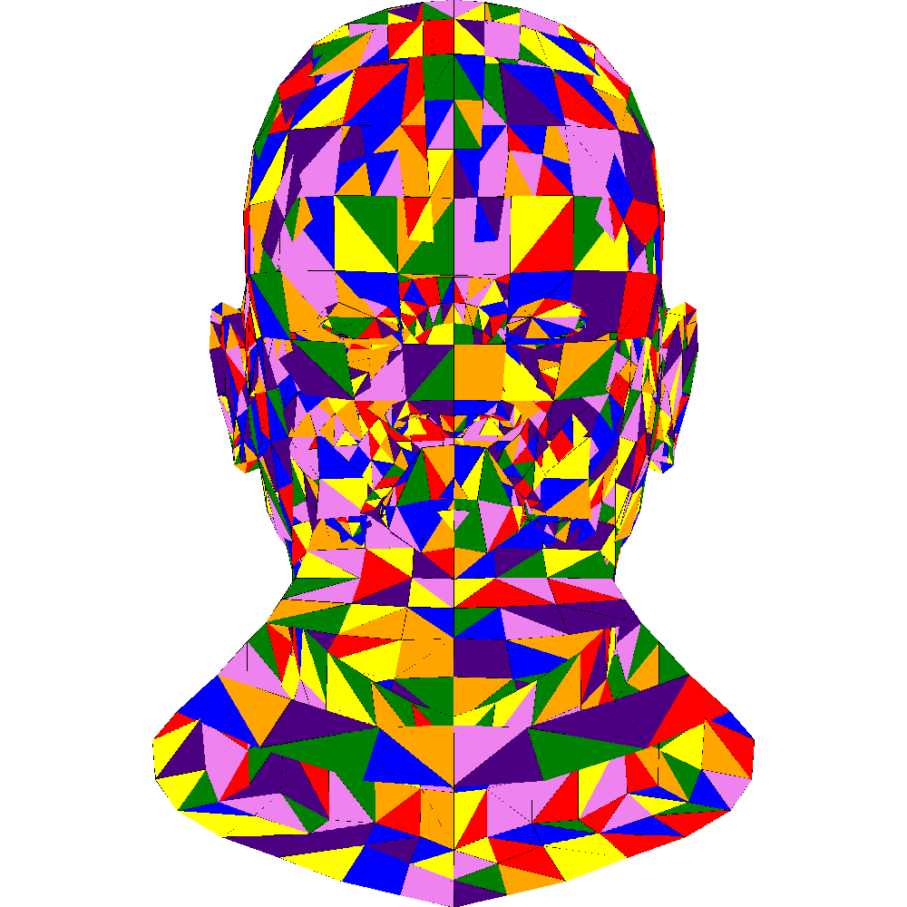

# tinyrenderer_learn

learn <https://github.com/ssloy/tinyrenderer>

# lesson 1

 
lession1
   

# lession 2

 
lession2_single_tri_sweep_line
   

 
lession2_single_tri_barycentric
   

 
lession2_random_color
   

 
lession2_light
   

# lession 3

 
lession3_before_rast
   

 
lession3_ybuf
   

 
lession3_zbuffer
   
